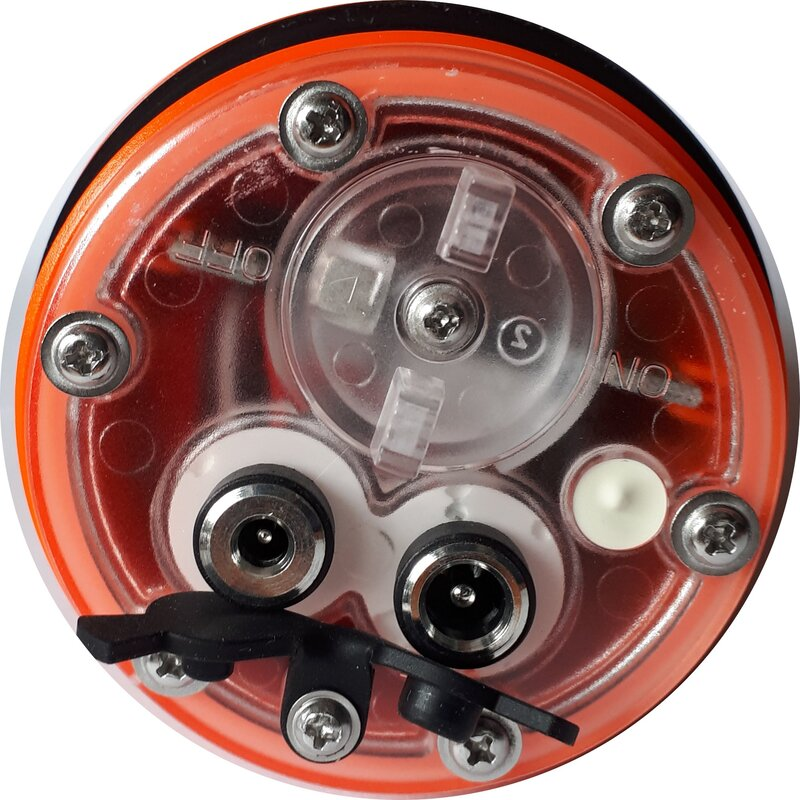
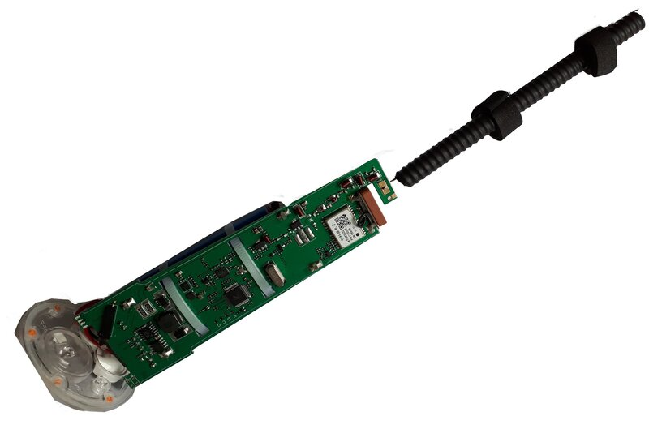
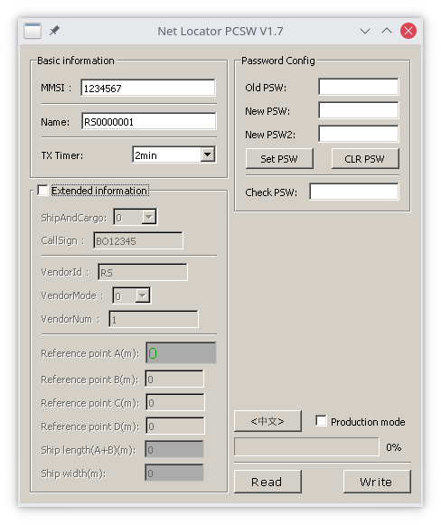

# RS-109M AIS Net Locator AIS buoy info

This repo contains info about the RS-109M Net Locator AIS buoy.
The device is sold by [Socotron](http://web.archive.org/web/20210806132018/https://socotran.com/products/fishing-net-tracker-locator-gps-marine-ais-netsonde-net-sonde-for-boating-rs-109m) and is also available on Ali\*xpress and e\*ay. In the UK, it is also sold by [East Anglian Radio](http://web.archive.org/web/20210806152420/https://www.eastanglianradio.com/rs-109-ais.html).

Information was gathered by personal observations like photographs of the PCB, and logging of the data stream while configuring.

## Attention

It is questionable if this device could be operated as a proper ("valid", "legal") AIS device!

Take appropriate measures when trying out things (e.g. shield RF, dummy load).

See [FCC statement](http://web.archive.org/web/20210806152632/https://docs.fcc.gov/public/attachments/DA-18-1211A1_Rcd.pdf) concerning the ban of fishing net buoys that use radio frequencies reserved for marine navigation safety.

## Internals

Unscrewing the cap gives access to on/off switch (a magnet which acts on a reed relais) and the charging and programming connectors:

The PCB in all its glory:

## PCSW 1.7 software

The software is available upon request from the dealer.
It is a Qt application compiled for Windows. I could get it to start with Wine 6.14 on Linux (Linux 5.12.15-arch1-1 x86_64, ArchLinux distribution), but had no chance to get the serial communications running.

Using the software on a Windows VM, I was able to produce some [logs](logs/) to get knowledge of the serial protocol.

"Production mode" seems to do nothing more than incrementing MMSI number on subsequent writes.

## Configuration protocol

See [logs dir](logs/) for data I obtained while doing tiny configuration changes.

The protocol is via serial 115200,8n1.

Device expects an init sequence with a password. This password is a weak protection, as it defaults to 000000 and is in the range of 0..999999.

Initialisation has to take place in the first few seconds after power-up.

After init, you can do 3 things:
 * read config
 * write config
 * set/clear password

Config is done as a whole block of data with some values stuffed together to save some space.

## Hardware

Buoy is built around Si4463 radio.

Microprocessor matches the layout of ubiquitous STM32F103C8, but as it has no markings, it could as well be a clone or different STM32 ARM µC.
A SWDIO debug port is available on the PCB (marked G=ground, C=clock, D=swdio, V=VCC), but did not check.

GPS module is ATGM332D with GPS and BDS/BeiDou support, but no GLONASS. It seems to be tied only with its TX pin to an RX pin of the µC.

See [MAIANA AIS project](https://github.com/peterantypas/maiana) for a far more capable Open Source board.
